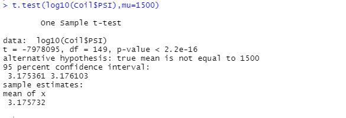
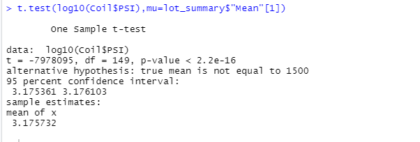
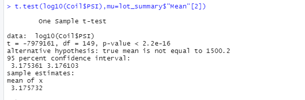
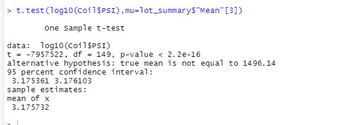

# MechaCar_Statistical_Analysis
R

## Linear Regression to Predict MPG

2 Variables provide non-random variance: Vehicle_length & Ground_clearance

The slope is not zero as the co-effiencts that are statistically significant are greater than 0

The model predicts the mpg faily well with an adjusted R sqaured of 68 and a very small P value

## Summary Statistics on Suspension Coils

Cummulatively the suspension coils meet the deisgn specification of a sub 100 PSI variance however mesuring the lots individually we see that lot 3 does not meet the specification with a variance of 220.

## T-Tests on Suspension Coils

With the very small p-value the sample mean is not significantly different from the population mean of 1500

With the very small p-value the sample mean is not significantly different from the Lot 1 mean

With the very small p-value the sample mean is not significantly different from the Lot 2 mean

With the very small p-value the sample mean is not significantly different from the Lot 3 mean

