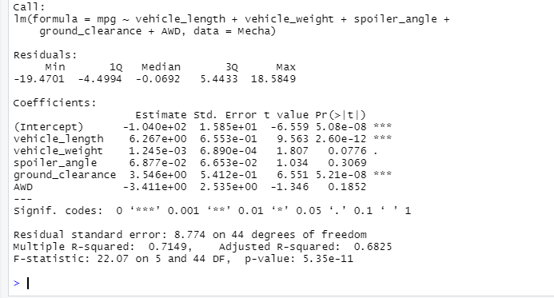

# MechaCar_Statistical_Analysis
R

## Linear Regression to Predict MPG

2 Variables provide non-random variance: Vehicle_length & Ground_clearance

The slope is not zero as the co-effiencts that are statistically significant are greater than 0

The model predicts the mpg faily well with an adjusted R sqaured of 68 and a very small P value

